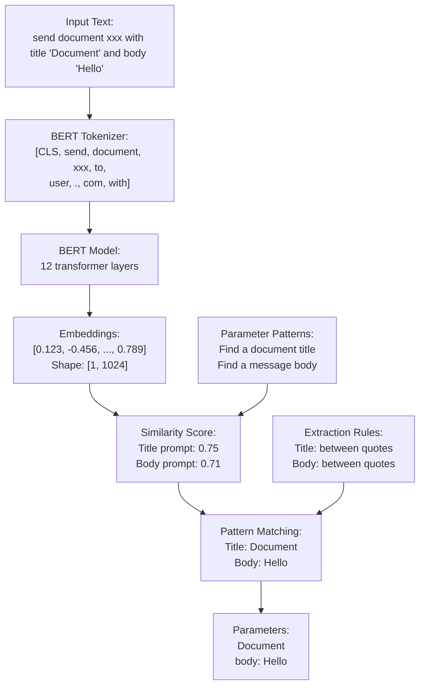

# BERT Parameter Extractor

A Rust implementation of a parameter extraction system using BERT embeddings to identify and extract structured information from natural language text.


## Example Usage

```rust
let extractor = ParameterExtractor::new()?;
let text = "send the document xxx to user@email.com with title 'Document' and body 'Hello'";
let parameters = extractor.extract_parameters(text)?;
```

## How It Works




### Step-by-Step Process

1. **Text Processing**
   - Input text is tokenized using BERT tokenizer
   - Tokens are converted to embeddings using BERT model
   - CLS token (first token) embedding is extracted and normalized

2. **Pattern Matching**
   - Pre-defined patterns for each parameter type (email, title, body, attachment)
   - Each pattern is converted to embeddings using the same process
   - Cosine similarity is calculated between text and pattern embeddings

3. **Value Extraction**
   - If similarity score > 0.5, attempt to extract the value
   - Different extraction methods per parameter type:
     - Email: Look for @ symbol
     - Title/Body: Extract text between quotes
     - Attachment: Match specific file patterns

## Supported Parameters

| Type | Description | Example |
|------|-------------|---------|
| email | Email addresses | user@example.com |
| title | Document titles | 'Document Title' |
| body | Message content | 'Message text' |
| attachment | File names | document.pdf, xxx |


## Local GitHub Actions Testing

### Install Act
On Mac:
```bash
brew install act
```

On Ubuntu:
```bash
# Using script installer
curl -s https://raw.githubusercontent.com/nektos/act/master/install.sh | sudo bash

# Or using snap
sudo snap install act


### If it doesn't work try :

#### Download the latest binary
cd /tmp
curl -L -o act.tar.gz https://github.com/nektos/act/releases/latest/download/act_Linux_x86_64.tar.gz

#### Extract it
tar xf act.tar.gz

#### Move to a directory in your PATH
sudo mv act /usr/local/bin/

#### Make it executable
sudo chmod +x /usr/local/bin/act
```

### Running Actions Locally

1. Run a dry-run to see what would happen:
```bash
act -n
```

2. Run all workflows:
```bash
act
```

3. Run a specific job:
```bash
act -j test    # Run only tests
act -j clippy  # Run only clippy checks
act -j format  # Run only format checks
```

4. Run with verbose output:
```bash
act -v
```

Note: The first run might take some time as it downloads the required Docker images.

### Common Issues
- If you get Docker permission errors on Ubuntu, add your user to the docker group:
  ```bash
  sudo usermod -aG docker $USER
  # Log out and back in for changes to take effect
  ```
- If you see "invalid reference format" on Mac, ensure Docker Desktop is running


## Dependencies

- candle-core: BERT model implementation
- tokenizers: Text tokenization
- hf-hub: Hugging Face model hub access
- anyhow: Error handling

## Model

Uses the `katanemo/bge-large-en-v1.5` BERT model from Hugging Face for embeddings generation.
