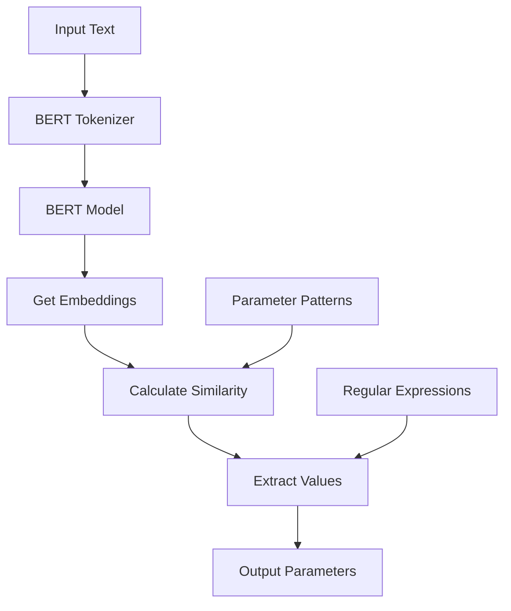

# BERT Parameter Extractor

A Rust implementation of a parameter extraction system using BERT embeddings to identify and extract structured information from natural language text.

## How It Works



### Step-by-Step Process

1. **Text Processing**
   - Input text is tokenized using BERT tokenizer
   - Tokens are converted to embeddings using BERT model
   - CLS token (first token) embedding is extracted and normalized

2. **Pattern Matching**
   - Pre-defined patterns for each parameter type (email, title, body, attachment)
   - Each pattern is converted to embeddings using the same process
   - Cosine similarity is calculated between text and pattern embeddings

3. **Value Extraction**
   - If similarity score > 0.5, attempt to extract the value
   - Different extraction methods per parameter type:
     - Email: Look for @ symbol
     - Title/Body: Extract text between quotes
     - Attachment: Match specific file patterns

## Example Usage

```rust
let extractor = ParameterExtractor::new()?;
let text = "send the document xxx to user@email.com with title 'Document' and body 'Hello'";
let parameters = extractor.extract_parameters(text)?;
```

## Supported Parameters

| Type | Description | Example |
|------|-------------|---------|
| email | Email addresses | user@example.com |
| title | Document titles | 'Document Title' |
| body | Message content | 'Message text' |
| attachment | File names | document.pdf, xxx |

## Dependencies

- candle-core: BERT model implementation
- tokenizers: Text tokenization
- hf-hub: Hugging Face model hub access
- anyhow: Error handling

## Model

Uses the `katanemo/bge-large-en-v1.5` BERT model from Hugging Face for embeddings generation.
